# 数据结构

PS: 各数据结构操作时间复杂度也需要分析

## 1.SDS(简单动态字符串)
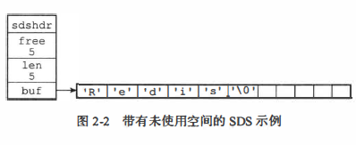
* Redis只会使用C字符串作为字面量，在大多数情况下，Redis使用SOS(Simple Dynamic String, 简单动态字符串）作为字符串表示。
* 比起C字符串，sos具有以下优点：
    1. 常数复杂度获取字符串长度。
    2. 杜绝缓冲区溢出。
    3. 减少修改字符串长度时所需的内存重分配次数。
    4. 二进制安全。
    5. 兼容部分C字符串函数。
    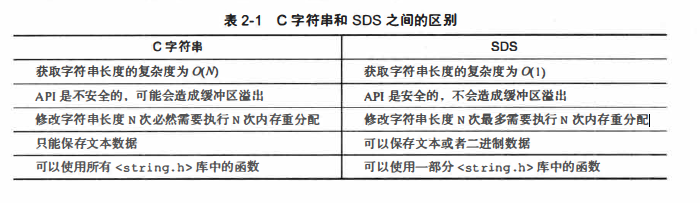

## 2.链表
由list结构和listNode结构组成的链表
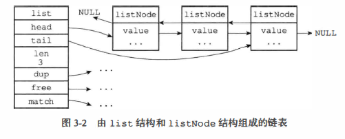
* 双端：链表节点带有prev和next指针，获取某个节点的前置节点和后置节点的复杂度都是0(1)。
* 无环：表头节点的prev指针和表尾节点的next指针都指向NULL, 对链表的访问以NULL为终点。
* 带表头指针和表尾指针：通过list结构的head指针和tail指针，程序获取链表的表头节点和表尾节点的复杂度为0(1)。
* 带链表长度计数器：程序使用list 结构的len 属性来对巨st 持有的链表节点进行计数， 程序获取链表中节点数量的复杂度为0(1)。
* 多态：链表节点使用void*指针来保存节点值，并且可以通过list结构的dup、free、match三个属性为节点值设置类型特定函数，所以链表可以用于保存各种不同类型的值。

## 3.字典
### 3.1 基础数据结构
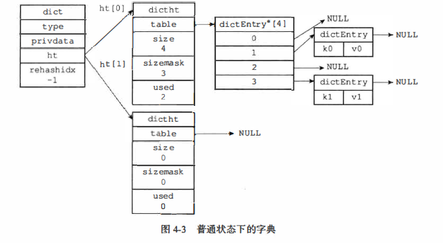
* size 属性记录了哈希表的大小， 也即是table数组的大小
* 而used属性则记录了哈希表目前已有节点（键值对）的数量
* sizemask属性的值总是等于size-1
* ht[1]哈希表只会在对ht[O]哈希表进行rehash时使用。
* rehashidx如果目前没有在进行rehash, 那么它的值为-1。

### 3.2 哈希算法
```
＃使用字典设置的哈希函数，计算键key的哈希值
hash= dict->type->hashFunction(key);
＃使用哈希表的sizemask属性和哈希值，计算出索引值
＃根据情况不同，ht[x]可以是ht[OJ或者h1[1]
index = hash & dict->ht[x].sizemask;
```

### 3.3 解决冲突
链地址法

### 3.4 rehash
* 具体图示见书《Redis设计与实现》 ps:迁移是渐进式一个一个迁移的
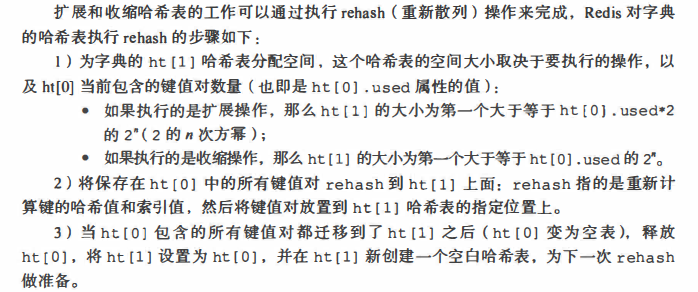

* 哈希表的扩展与收缩
   当以下条件中的任意一个被满足时， 程序会自动开始对哈希表执行扩展操作：
   1. 服务器目前没有在执行BGSAVE命令或者BGREWRITEAOF命令， 并且哈希表的负载因子大于等于1。
   2. 服务器目前正在执行BGSAVE命令或者BGREWRITEAOF命令， 并且哈希表的负载因子大于等于5。
   ```
   其中哈希表的负载因子可以通过公式：
   ＃负载因子＝ 哈希表巳保存节点数量／哈希表大小
   load_factor = ht[OJ.used / ht[O].size
   ```
* 渐进式rehash
   因为在进行渐进式rehash的过程中，字典会同时使用ht[O]和ht[1]两个哈希表，所以在渐进式rehash进行期间，字典的删除(delete)、查找(find)、更新(update) 等操作会在两个哈希表上进行。例如，要在字典里面查找一个键的话，程序会先在ht[0]里面进行查找，如果没找到的话，就会继续到ht[1]里面进行查，诸如此类。另外，在渐进式rehash 执行期间，新添加到字典的键值对一律会被保存到ht[1]里面，而ht[O]则不再进行任何添加操作，这一措施保证了ht[O]包含的键值对数量会只减不增，并随着rehash操作的执行而最终变成空表。

## 4.跳跃表
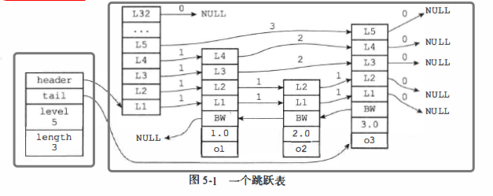

## 5.整数集合
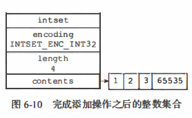

* 整数集合是集合键的底层实现之一。
* 整数集合的底层实现为数组，这个数组以有序、无重复的方式保存集合元素，在有需要时，程序会根据新添加元素的类型，改变这个数组的类型。
* 升级操作为整数集合带来了操作上的灵活性，并且尽可能地节约了内存。(例如最开始是int_16,超过范围后所有都升级为int_32)
* 整数集合只支持升级操作，不支持降级操作。

## 6.压缩列表
### 6.1 构成
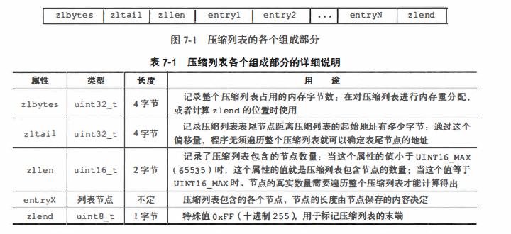

### 6.2 entry节点构成
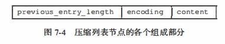

* 节点的previous_entry_length属性以字节为单位， 记录了压缩列表中前一个节点的长度
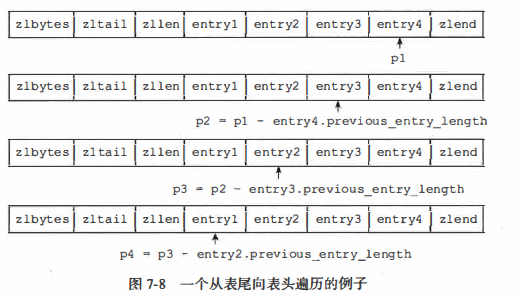
* 节点的encoding属性记录了节点的conte正属性所保存数据的类型以及长度

## 7.对象
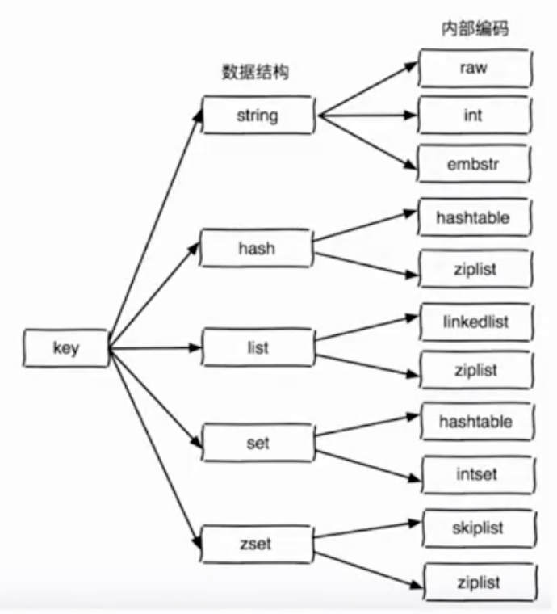

### 7.1 string
* raw SDS
   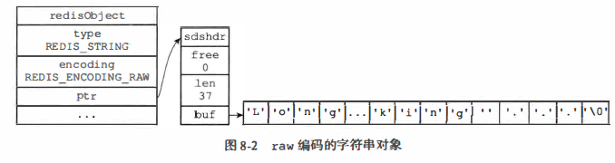   
* int 指针指向int
   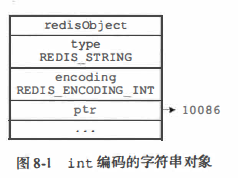
* embstr 字符串长度小于32字节，则用embstr
   * embstr 编码将创建字符串对象所需的内存分配次数从raw编码的两次降低为一次。
   * 释放embstr 编码的字符串对象只需要调用一次内存释放函数，而释放raw编码的字符串对象需要调用两次内存释放函数。
   * 因为embstr 编码的字符串对象的所有数据都保存在一块连续的内存里面，所以这种编码的字符串对象比起raw 编码的字符串对象能够更好地利用缓存带来的优势。
   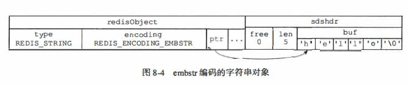 
### 7.2 list
* ziplist
   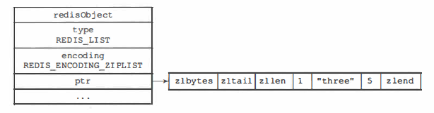
* linkedlist
   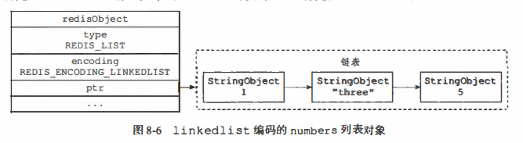

### 7.3 hash

### 7.4 set
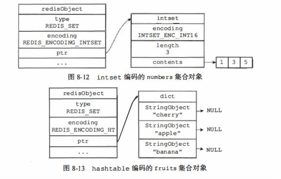

### 7.5 zset
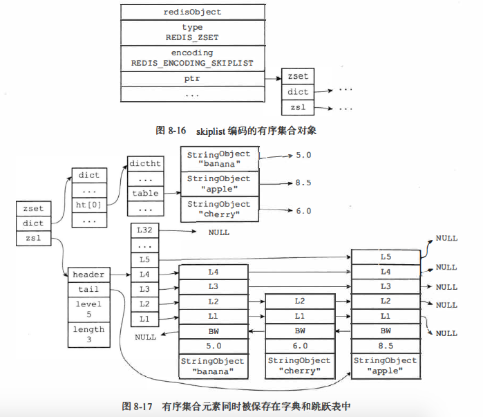

# 补充
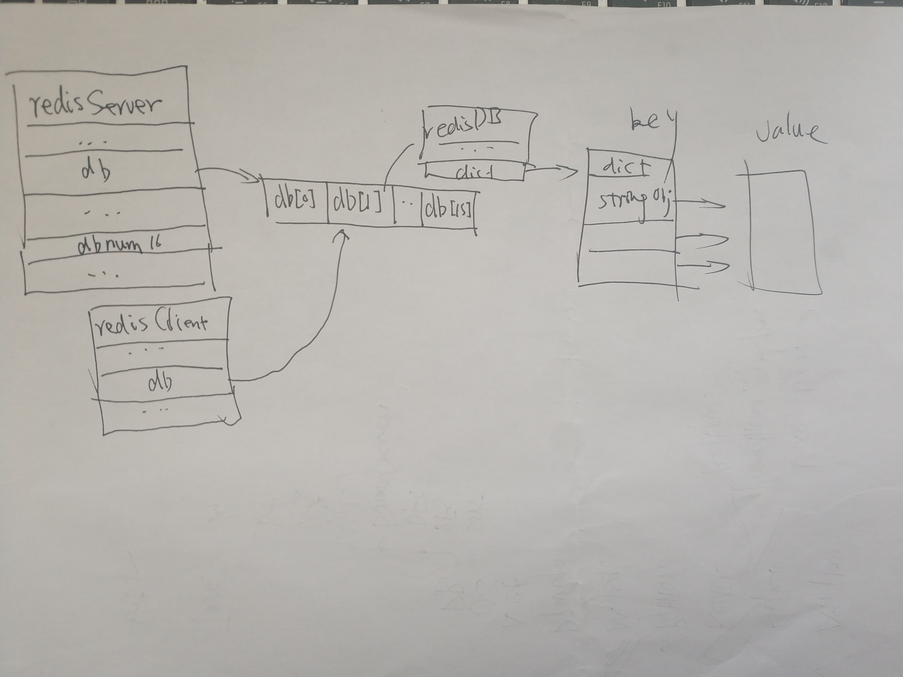