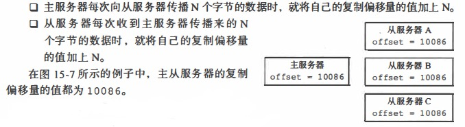
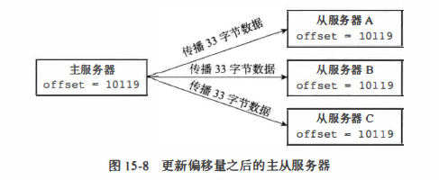
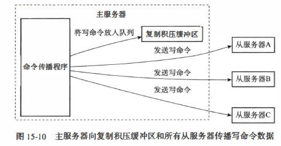
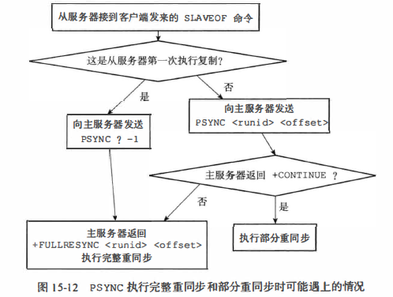
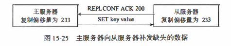

## Redis主从服务器
### 1.复制
假如有两台redis服务器，127.0.0.1:6379 和127.0.0.1:12345<br>
对12345下如下命令：<br>
```bash
SLAVEOF 127.0.0.1 6379
```
那么12345将成为6379的从服务器

#### 1.1旧版本复制功能实现
Redis的复制功能分为同步和命令传播两个操作
* 同步操作用于将副武器的数据库状态更新至主服务器当前所处的数据库状态
   1. 从->主，发送SYNC命令
   2. 主执行BGSAVE
   3. 主->从，发送RDB文件
   4. 主->从，将记录在缓冲区里面所有命令发送

* 命令传播则用于在主服务器的数据库状态被修改，导致主从服务器的数据库状态出现不一致时，让主从服务器的数据库重新回到一致状态

缺陷：
断线后复制也需要RDB，效率会非常低

#### 1.2新版本复制功能的实现
PSYNC命令代替SYNC命令来执行复制时的同步操作。<br>
PSYNC命令具有完整重同步(full resync虹onization)和部分重同步(partial resync比onization)
两种模式：
* 其中完整重同步用千处理初次复制情况： 完整重同步的执行步骤和SYNC命令的执行步骤基本一样， 它们都是通过让主服务器创建并发送ROB文件， 以及向从服务器发送保存在缓冲区里面的写命令来进行同步。
* 而部分重同步则用于处理断线后重复制情况： 当从服务器在断线后重新连接主服务器时， 如果条件允许， 主服务器可以将主从服务器连接断开期间执行的写命令发送给从服务器， 从服务器只要接收并执行这些写命令， 就可以将数据库更新至主服务器当前所处的状态。
   * 主服务器的复制偏移噩(replication offset)和从服务器的复制偏移量
   
   
   * 主服务器的复制积压缓冲区(replication backlog)
      * 如果offset偏移量之后的数据（也即是偏移量offset+l开始的数据）仍然存在于复制积压缓冲区里面， 那么主服务器将对从服务器执行部分重同步操作。
      * 相反,如果offs釭偏移撇之后的数据已经不存在千复制积压缓冲区， 那么主服务器将对从服务器执行完整重同步操作
    


   * 服务器的运行ID (run ID)
      * 如果从服务器保存的运行ID和当前连接的主服务器的运行ID相同，那么说明从服务器断线之前复制的就是当前连接的这个主服务器，主服务器可以继续尝试执行部分重同步操作。
      * 相反地，如果从服务器保存的运行ID和当前连接的主服务器的运行1D 并不相同，那么说明从服务器断线之前复制的主服务器并不是当前连接的这个主服务器，主服务器将对从服务楛执行完整重同步操作。
   

#### 1.3心跳检测
在命令传播阶段， 从服务器默认会以每秒一次的频率， 向主服务器发送命令：
```
REPLCONF ACK <replication_offset>
```
其中replica巨on offset 是从服务器当前的复制偏移量。发送REPLCONF ACK命令对于主从服务器有三个作用：
* 检测主从服务器的网络连接状态
   * 如果主服务器超过一秒钟没有收到从服务器发来的REPLCONF ACK命令， 那么主服务器就知道主从服务器之间的连接出现问题了。
* 辅助实现min-slaves 选项
* 检测命令丢失


