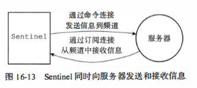
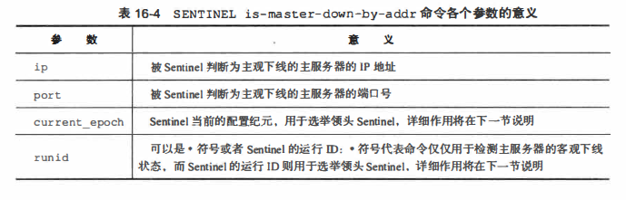
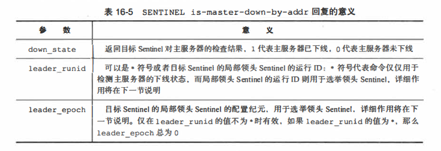

# Sentienl

## 1.初始化Sentienl
```bash
redis-sentinel /path/to/your/sentinel.conf
redis-server /path/to/your/sentinel.conf --sentinel
```
当一个Sentinel启动时， 它需要执行以下步骤：
1. 初始化服务器。
2. 将普通Redis服务器使用的代码替换成Sentinel专用代码。
3. 初始化Sentinel状态。
4. 根据给定的配置文件，初始化Sentinel的监视主服务器列表。
5. 创建连向主服务器的网络连接
   对于每个被Sentinel 监视的主服务器来说， Sentinel 会创建两个连向主服务器的异步网络连接：
   * 一个是命令连接， 这个连接专门用于向主服务器发送命令， 并接收命令回复。
   * 另一个是订阅连接， 这个连接专门用于订阅主服务器的sentinel :hello 频道

## 2.获取主服务器信息
在一般情况下， Sentinel以每十秒一次的频率向被监视的主服务器和从服务器发送INFO命令，当主服务器处于下线状态，或者Sentinel正在对主服务器进行故障转移操作时，Sentinel向从服务器发送INFO命令的频率会改为每秒一次
```
# Server
run_id:76llc59dc3a29aa6fa0609f84lbb6al019008a9c
...

# Replication
role:master
slaveO:ip= l27.0.0.1,port=11111, state=online, offset=43, lag=O
slavel:ip=l27.0.0.l,port=22222,state=online,offset=43,lag=O
slave2:ip= l27.0.0.l,port=33333,state=online,offset=43,lag=O
...

# Other sections
...
```
* 一方面是关于主服务器本身的信息，包括run_id域记录的服务器运行ID，以及
role域记录的服务器角色
* 另一方面是关于主服务器属下所有从服务器的信息，每个从服务器都由一个"slave"
字符串开头的行记录，每行的ip=域记录了从服务器的IP地址，而port=域则记录了从服务器的端口号。根据这些IP地址和端口号，Sentinel无须用户提供从服务器的地址信息，就可以自动发现从服务器

## 3.获取从服务器信息
当Sentinel发现主服务器有新的从服务器出现时，Sentinel除了会为这个新的从服务器创建相应的实例结构之外，Sentinel还会创建连接到从服务器的命令连接和订阅连接。
```
# Server
run_id:32be0699dd27b410f7c90dada3a6fabl7f97899f
...

# Replication
role:slave
master_host:127.0.0.1
master_port:6379
master_link_status:up
slave_repl_offset:11887
slave_priority:100
...

# Other sections
...
```

## 4.像主服务器和从服务器发送信息
对于监视同一个主服务器和从服务器的多个Sentinel来说，它们会以每两秒一次的频率，通过向被监视服务器的_sentinel_:hello频道发送消息来向其他Sentinel宣告自己的存在。

## 5.接收来自主服务器和从服务器的频道信患
每个Sentinel也会从_sentinel_:hello频道中接收其他Sentinel发来的信息，并根据这些信息为其他Sentinel创建相应的实例结构，以及命令连接



## 6.检测主观下线状态
Sentinel以每秒一次的频率向实例（包括主服务器、从服务器、其他Sentinel)发送PING命令，并根据实例对PING命令的回复来判断实例是否在线，当一个实例在指定的时长中连续向Sentinel发送无效回复时，Sentinel会将这个实例判断为主观下线

## 7.检查客观下线状态
### 7.1发送SENTINEL is-master-down-by-addr命令
```
SENTINEL is-master-down-by-addr <ip> <port> <curren七_epoch> <runid>
```


### 7.2 接收SENTINEL is-master-down-by-addr命令
目标Sentinel会分析并取出命令请求中包含的各个参数，并根据其中的主服务器lP和端口号，检查主服务器是否已下线，然后向源Sentinel返回一条包含三个参数的Multi Bulk回复作为SENTINEL is-master-down-by命令的回复：
```
1) <down_state>
2) <leader_runid>
3) <leader_epoch>
```


## 8.选举领头羊Sentinel
* 每个发现主服务器进入客观下线的Sentinel都会要求其他Sentinel将自己设置为局部领头Sentinel
* 当一个Sentinel (源Sentinel)向另一个Sentinel (目标Sentinel)发送SENTINEL is-master-down-by-addr命令， 并且命令中的runid参数不是＊符号而是源Sentinel的运行ID时，这表示源Sentinel要求目标Sentinel将前者设置为后者的局部领头Sentinel
* 发送命令时，自己会选举自己
* 选举成功后会告诉其他candidate选举成功
```
SENTINEL is-master-downby-addr 127.0.0.1 6379 0 e955b4c85598ef5b5f055bc7ebfd5e828dbed4fa
```

## 9.故障转移
* 选取主服务器
```
删除
1) 删除列表中所有处于下线或者断线状态的从服务器， 这可以保证列表中剩余的
从服务器都是正常在线的。
2) 删除列表中所有最近五秒内没有回复过领头Sentinel 的INFO 命令的从服务器，
这可以保证列表中剩余的从服务器都是最近成功进行过通信的。
3) 删除所有与已下线主服务器连接断开超过down-after-milliseconds * 10
毫秒的从服务器;换句话说， 列表中剩余的从服务器保存的数据都是比较新的。

筛选
1）选取优先级较高的
2）选取offset最大的服务器（即最新数据的服务器）
3）选取运行ID最小的服务器
```
* 修改从服务器的复制目标
* 将旧的主服务器变为从服务器
