# Redis Cluster

## 1.节点
```
CLUSTER MEET <ip> <port>
```
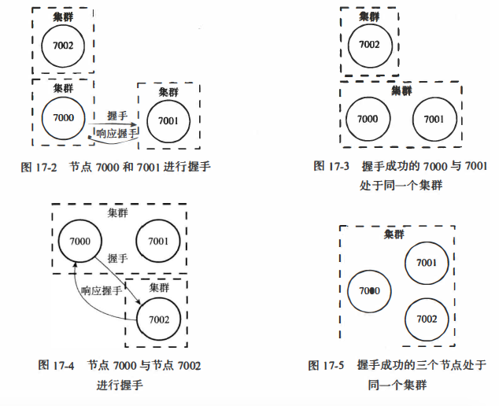

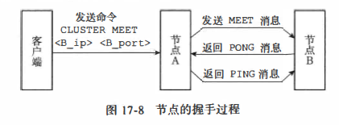

连接成功后，节点A会将节点B的信息通过Gossip协议传播给集群中的其他节点，让其他节点也与节点B进行握手，最终，经过一段时间之后，节点B会被集群中的所有节点认识。

## 2.槽指派
```bash
CLUSTER ADDSLOTS <slot> [slot ... ]
CLUSTER ADDSLOTS O 1 2 3 4 ... 5000
# 16384个槽分配完成，此时才能上线
```
* clusterState.slots数组记录了集群中所有槽的指派信息
   * 如果节点只使用clusterNode.slots数组来记录槽的指派信息，那么为了知道槽i是否已经被指派，或者槽i被指派给了哪个节点，程序需要遍历clusters.nodes字典中的所有clusterNode结构，检查这些结构的slots数组， 直到找到负责处理槽1的节点为止，这个过程的复杂度为O(N), 其中N为clusterState.nodes字典保存的clusterNode结构的数量。
   * 通过将所有槽的指派信息保存在clusterState.slots数组里面，程序要检查槽i是否已经被指派，又或者取得负责处理槽i 的节点，只需要访问clusterState.slots[i]的值即可，这个操作的复杂度仅为0(1)
* clusterNode.slots 数组只记录了clusterNode 结构所代表的节点的槽指派信息
   * 因为当程序需要将某个节点的槽指派信息通过消息发送给其他节点时， 程序只需要将相应节点的clusterNode.slots 数组整个发送出去就可以了。
   * 另一方面， 如果Redis 不使用clusterNode.slots 数组， 而单独使用clusterState.slots 数组的话， 那么每次要将节点A 的槽指派信息传播给其他节点时，程序必须先遍历整个clusterstate.slots 数组，记录节点A负责处理哪些槽，然后才能发送节点A的槽指派信息，这比直接发送clusterNode.slots数组要麻烦和低效得多

## 3.在集群中执行命令
### 3.1计算属于哪个槽
节点使用以下算法来计算给定键key属于哪个槽:
```
def slot_number(key):
    return CRC16(key) & 16383
```

### 3.2 Moved
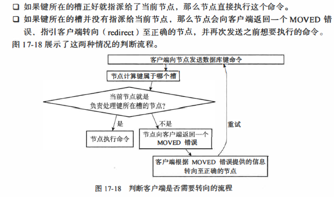
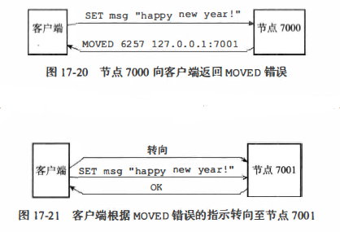
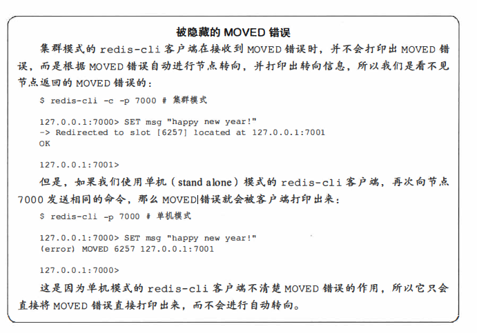

### 3.3 节点数据库实现
* 节点和单机服务器在数据库方面的一个区别是， 节点只能使用0号数据库， 而单机
Redis服务器则没有这一限制

* 除了将键值对保存在数据库里面之外， 节点还会用clusterState结构中的slots_to_keys跳跃表来保存**槽和键**之间的关系
   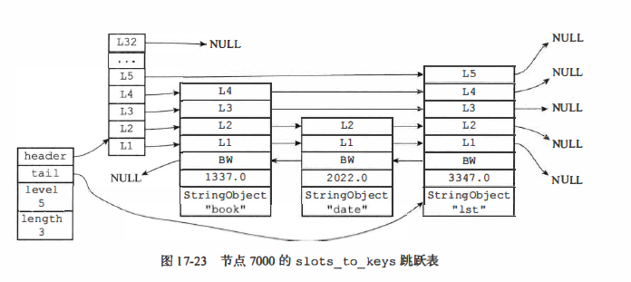

## 4.重新分片
### 4.1 重新分片步骤
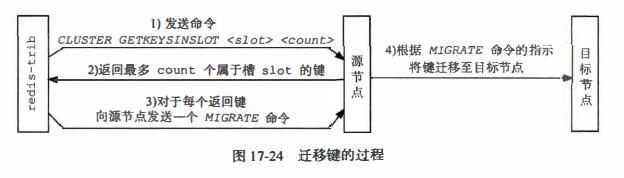
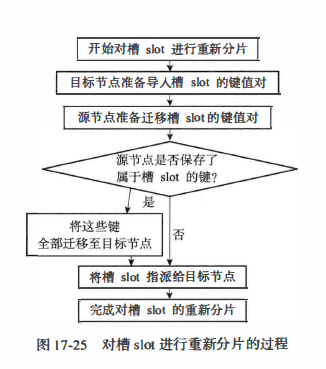

## 5.ASK错误
### 5.1 ASK错误(源节点)
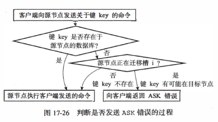
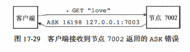

### 5.2 ASKING命令(迁移节点)
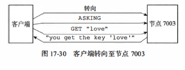
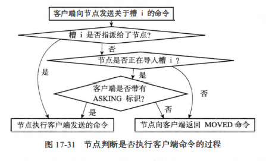

### 5.3 ASK和MOVED
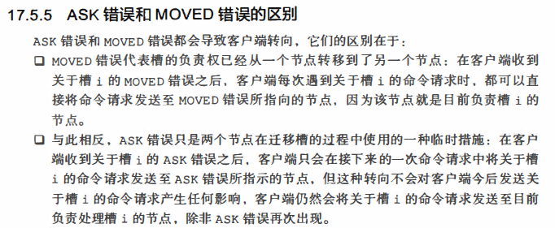

## 6.复制与故障转移
### 6.1 设置从节点
```
CLUSTER REPLICATE <node id>
```
可以让接收命令的节点成为node_id所指定节点的从节点， 并开始对主节点进行复制

### 6.2 故障检测
* 集群中的每个节点都会定期地向集群中的其他节点发送PING消息，以此来检测对方
是否在线，如果接收PING消息的节点没有在规定的时间内，向发送PING消息的节点返回PONG消息，那么发送PING消息的节点就会将接收PING消息的节点标记为疑似下线
(probable fail, PFAIL)
* 如果在一个集群里面，如果一个节点发现半数以上负责处理槽的主节点都将某个主节点x报告为疑似下线，那么这个主节点x将被标记为己下线(FAIL)
* 此时，将主节点x标记为已下线的节点会向集群广播一条关于主节点x的FAIL消息，所有收到这条FAIL消息的节点(包括主、从)都会立即将主节点x标记为已下线。

### 6.3 故障转移
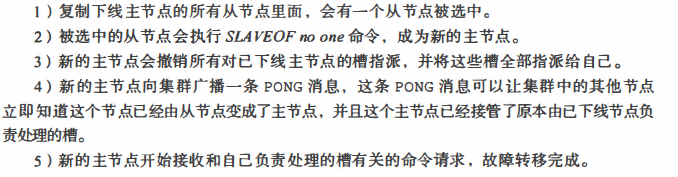

### 6.4 选举
* 从节点只有被选举权资格
* 主节点只有投票资格
* N/2+1张选票，N为主节点个数
* 其他的同Raft算法