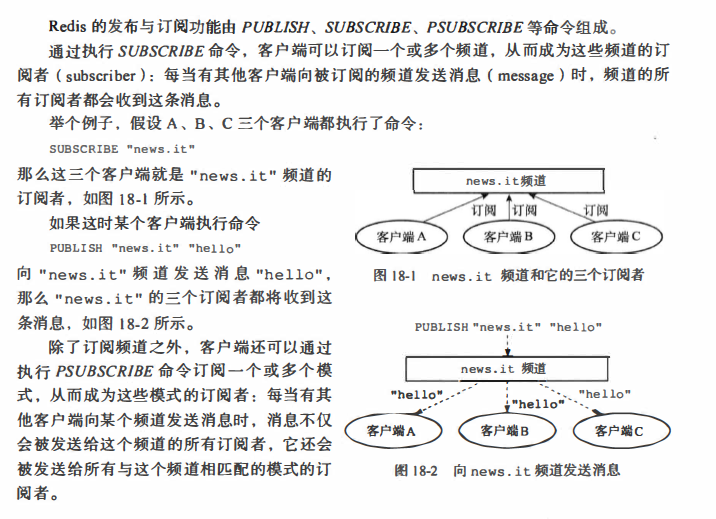

# 补充
## 1.发布与订阅

## 2.分布式
RedLock(http://www.redis.cn/topics/distlock.html)

## 3.hot key
### 缓存穿透、缓存雪崩、缓存击穿
https://baijiahao.baidu.com/s?id=1619572269435584821&wfr=spider&for=pc

### 采样方法判定热点key
哈希值采样，这样减少代价
（如何统计一定时间的哈希值）

## 4.过期键策略
* 定时删除：在设置键的过期时间的同时，创建一个定时器(timer)，让定时器在键的过期时间来临时，立即执行对键的删除操作。
* 惰性删除：放任键过期不管，但是每次从键空间中获取键时，都检查取得的键是否过期，如果过期的话，就删除该键；如果没有过期，就返回该键。
* 定期删除：每隔一段时间，程序就对数据库进行一次检查，删除里面的过期键。至于要删除多少过期键，以及要检查多少个数据库，则由算法决定。

redis采用惰性和定期：因为可能定期前就过期了，此时得利用惰性策略

* AOF和RDB均不会被过期键所影响

## 参考
[1]redis 系列（四）- Redis Cluster(https://www.jianshu.com/p/c26697412d72)